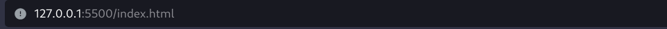

## A simple todo list using pure Typescript

---

### Steps to run

#### ```AFTER CLONING .. It is Preferred to use VSCode```

1. Install `` Live Server Extension`` if not installed in VSCode

2. Then inside VSCode there will be a button bottom right of the application ***which is part of the Live Server extension*** named ``Go Live``
 .. Press that button
3. Now when we go to this URL ``which is just our localhost server's index.html`` we will find it empty , That is because we dont really care now for the HTML we just want to see the browser's console

4. So now let's go to the ``Developer Tools``
which is usually in the browser's settings or you can just click `Ctrl+Shift+I` Then go to the ``Console`` tab


5. Now that is just printing out on the console and you can just see the tasks Before and After some modification .. nothing fancy yet 

### TO BE UPDATED